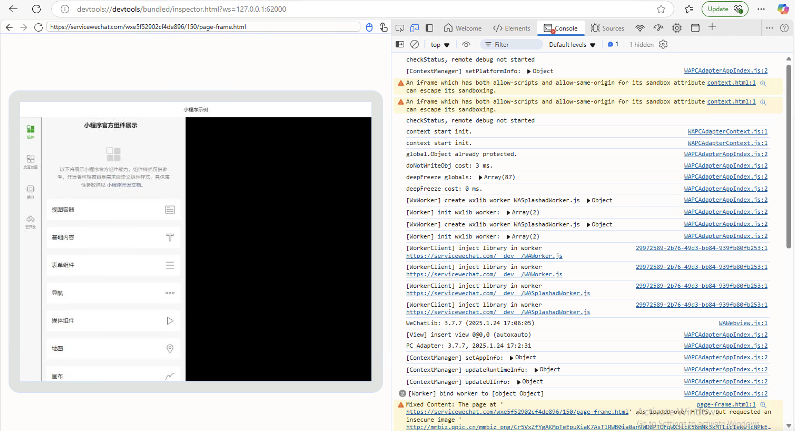
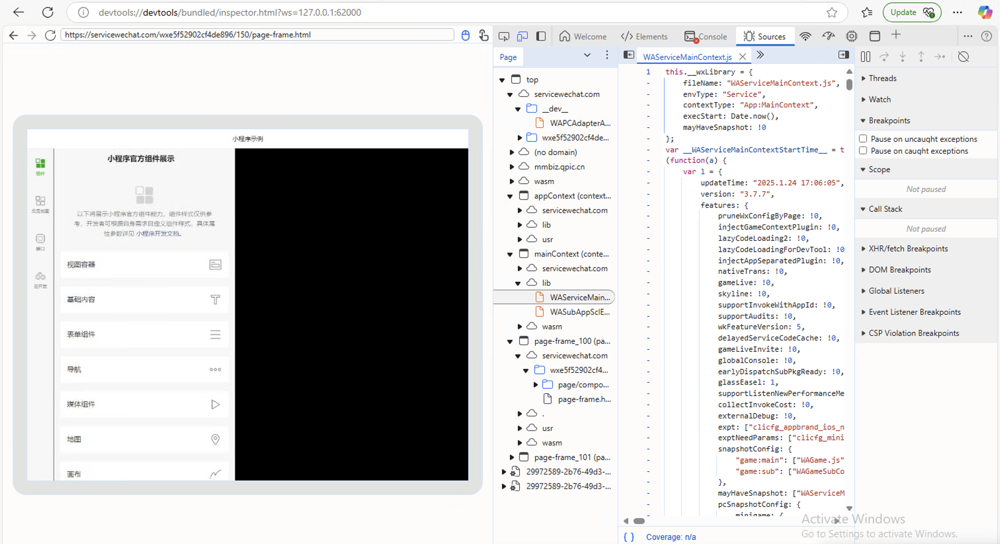

# WMPFDebugger-MCP

微信小程序安全审计与调试平台（Windows / macOS）

基于 Frida + CDP 协议的小程序动态调试工具，集成安全审计功能和 MCP（Model Context Protocol）AI 工具接口。

## 功能特性

**核心调试**
- Frida 动态注入 WeChatAppEx，强制开启远程调试（LanDebug 模式）
- 私有 protobuf 协议转标准 Chrome DevTools Protocol
- 支持 DevTools 全功能调试（Console、Sources、Network、DOM 等）
- 支持 Windows 和 macOS 双平台

**安全审计工具**
- **路由导航** — 自动枚举小程序所有页面路由，一键遍历触发接口
- **云函数审计** — Hook `wx.cloud.callFunction`，捕获/重放云函数调用，静态扫描脚本源码
- **wxapkg 解密解包** — V1MMWX 格式解密（AES-256-CBC + XOR），自动定位本地包文件
- **敏感信息扫描** — 87+ 正则规则检测 API Key、Token、PII、数据库连接串等
- **UserScript 注入** — Tampermonkey 风格脚本管理，支持持久化注入
- **反调试绕过** — `Debugger.setSkipAllPauses` 自动绕过 debugger 断点

**MCP AI 工具桥接**
- 63 个 MCP 工具，覆盖 DOM 操作、网络拦截、存储读写、截图、性能分析等
- 支持 Cursor、Claude Code 等 AI 工具直接调用
- stdio JSON-RPC 协议，零配置接入

**Electron GUI**
- 侧边栏多面板布局（控制台、路由、云审计、解包、扫描、脚本、设置）
- 实时日志流、进度条、数据表格
- Premium 暗色主题 + Glassmorphism 风格

## 支持状态

支持的 WMPF 版本：

* 19459 (最新, credit @snowflake-x)
* 19339 (credit @hidacow)
* 19201 (credit @hidacow)
* 19027 (credit @XKaguya)
* 18955 (credit @MapleLeaf2007)
* 18891 (credit @1357310795)

<details>

<summary>更早版本</summary>

* 18787
* 18151 (credit @1437649480, @zxjBigPower)
* 18055 (credit @Howard20181)
* 17127 (credit @Howard20181)
* 17071 (credit @hyzaw)
* 17037 (credit @linguo2625469)
* 16965
* 16815
* 16771
* 16467 (credit @51-xinyu)
* 16389 (credit @liding58)
* 16203 (credit @liding58)
* 16133 (credit @liding58)
* 14315 (credit @liding58)
* 14199
* 14161
* 13909
* 13871
* 13655
* 13639
* 13487
* 13341
* 13331
* 11633
* 11581 (成功连接但会随后渲染进程 crash，请自行测试)

</details>

如何调试微信内置浏览器页面：参见 [EXTENSION.md](EXTENSION.md)。注意，目前该方法仅有基础调试功能

如何检查版本：打开任务管理器，找到 WeChatAppEx 进程，右键，打开文件所在的位置，检查在 `RadiumWMPF` 和 `extracted` 之间的数字

如何适配到其他版本：参见 [ADAPTATION.md](ADAPTATION.md)。另外，你也可以提交版本适配的 Issue，我会尝试适配该版本如果我有相应的版本的 binary。仅更新版本的适配请求会被考虑

如何更新到最新的 WMPF 版本（微信版本 > 4.x）：官网 `pc.weixin.qq.com` 下载最新版微信。最新版 WMPF 会随新版安装包被一同安装。

如何更新到最新的 WMPF 版本（微信版本 < 4.x）：搜索框输入 `:showcmdwnd`（不要按回车触发搜索）弹出命令窗口，输入 `/plugin set_grayvalue=202&check_update_force` 并回车等待更新（如果有新版本）。重启微信以生效。


## 准备

* Node.js (需要至少 LTS v22)
    - yarn 包管理器
* 基于 Chromium 的浏览器（Chrome, Edge 等）
* Frida（通过 npm 自动安装）

## 使用

**方式一：Electron GUI（推荐）**

```bash
git clone https://github.com/0xdaxiong/WMPFDebugger-MCP
cd WMPFDebugger-MCP
yarn

# 启动 GUI
cd gui && npm start
```

GUI 启动后点击「启动 F12」即可自动注入并开启调试。所有安全审计功能通过侧边栏面板操作。

**方式二：命令行**

```bash
git clone https://github.com/0xdaxiong/WMPFDebugger-MCP
cd WMPFDebugger-MCP
yarn

# 启动调试服务器 + CDP 代理
npx ts-node src/index.ts
```

启动后打开小程序，然后访问 `devtools://devtools/bundled/inspector.html?ws=127.0.0.1:62000`

**方式三：MCP 接入 AI 工具**

在 AI 工具（Cursor / Claude Code）的 MCP 配置中添加：

```json
{
  "mcpServers": {
    "wmpf-debugger": {
      "command": "node",
      "args": ["gui/mcp_bridge.js"]
    }
  }
}
```

## 项目结构

```
├── src/                    # 核心调试服务（TypeScript）
├── frida/                  # Frida hook 脚本 + 版本配置
│   ├── hook.js
│   └── config/             # 各版本地址配置（含 mac/）
├── gui/                    # Electron GUI + MCP Bridge
│   ├── main.js             # 主进程
│   ├── mcp_bridge.js       # MCP 工具服务器（63 tools）
│   ├── modules/            # 功能模块
│   │   ├── cdp_client.js       # CDP WebSocket 客户端
│   │   ├── route_navigator.js  # 路由导航
│   │   ├── cloud_auditor.js    # 云函数审计
│   │   ├── wxapkg_decrypt.js   # wxapkg 解密解包
│   │   ├── sensitive_scanner.js # 敏感信息扫描
│   │   ├── userscript_manager.js # UserScript 管理
│   │   ├── anti_debug.js       # 反调试绕过
│   │   └── platform.js         # 平台检测
│   ├── inject/             # CDP 注入脚本
│   ├── rules/              # 检测规则（secret_rules.json）
│   └── ...
└── userscripts/            # 用户自定义脚本目录
```

## 截图





## 致谢

- [evi0s/WMPFDebugger](https://github.com/evi0s/WMPFDebugger) — 原始调试工具
- [Spade-sec/First](https://github.com/Spade-sec/First) — 安全审计功能参考

## 免责声明

**本库只能作为学习用途，造成的任何问题与本库开发者无关，如侵犯到你的权益，请联系删除**

该程序以 GPLv2 许可证开源，参考许可证第十一及十二条：

本程序为免费授权，故在适用法律范围内不提供品质担保。除非另作书面声明，版权持有人及其他程式提供者“概”不提供任何显式或隐式的品质担保，品质担保所指包括而不仅限于有经济价值和适合特定用途的保证。全部风险，如程序的质量和性能问题，皆由你承担。若程序出现缺陷，你将承担所有必要的修复和更正服务的费用

除非适用法律或书面协议要求，任何版权持有人或本程序按本协议可能存在的第三方修改和再发布者，都不对你的损失负有责任，包括由于使用或者不能使用本程序造成的任何一般的、特殊的、偶发的或重大的损失（包括而不仅限于数据丢失、数据失真、你或第三方的后续损失、其他程序无法与本程序协同运作），即使那些人声称会对此负责


此外，在 `src/third-party` 中，所有代码从微信开发者工具提取，因此腾讯控股有限公司拥有对该代码的所有版权


